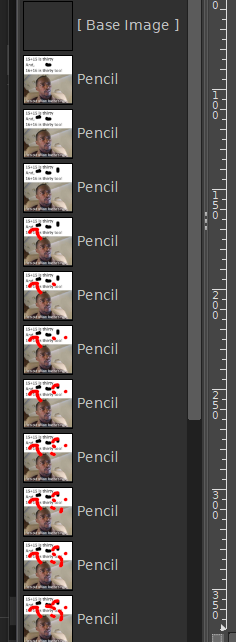
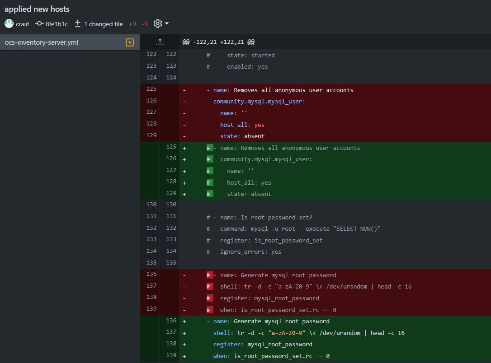
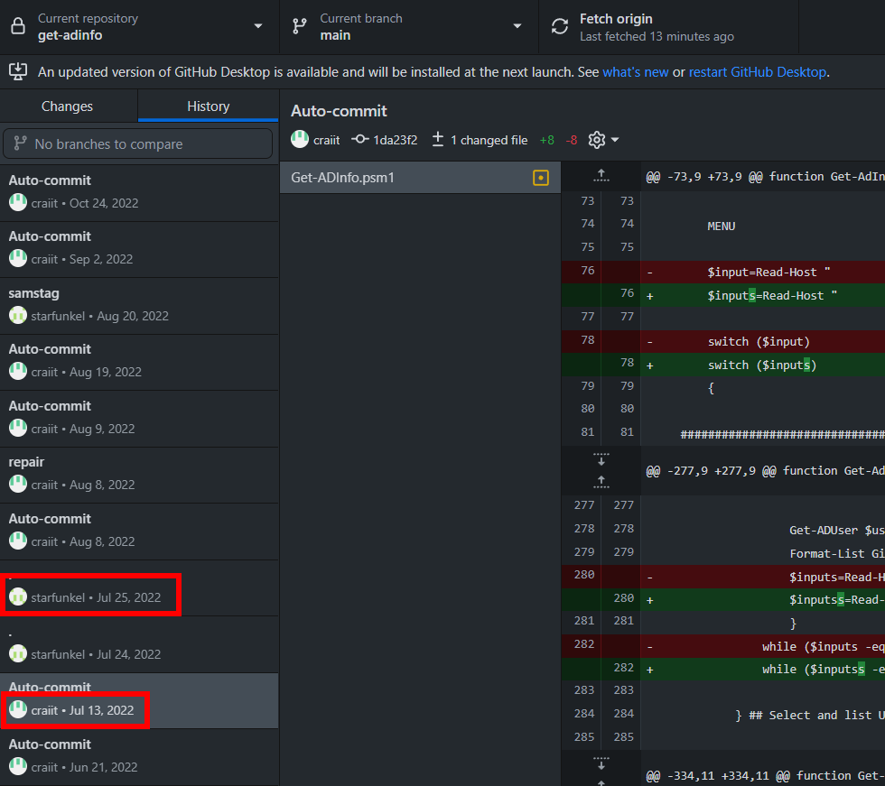
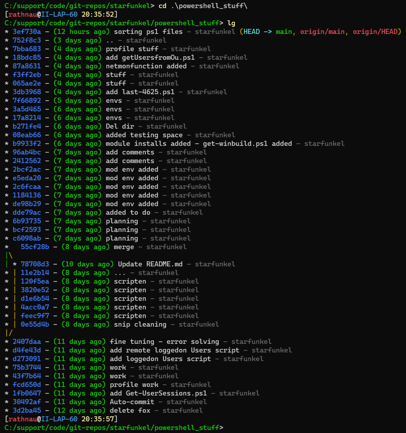
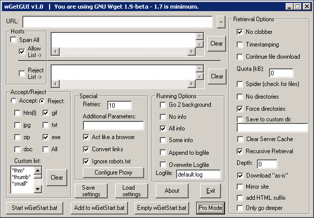
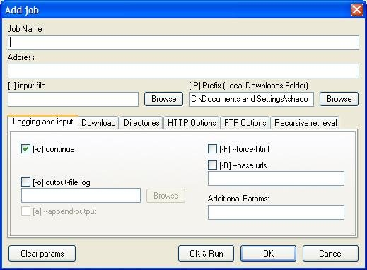
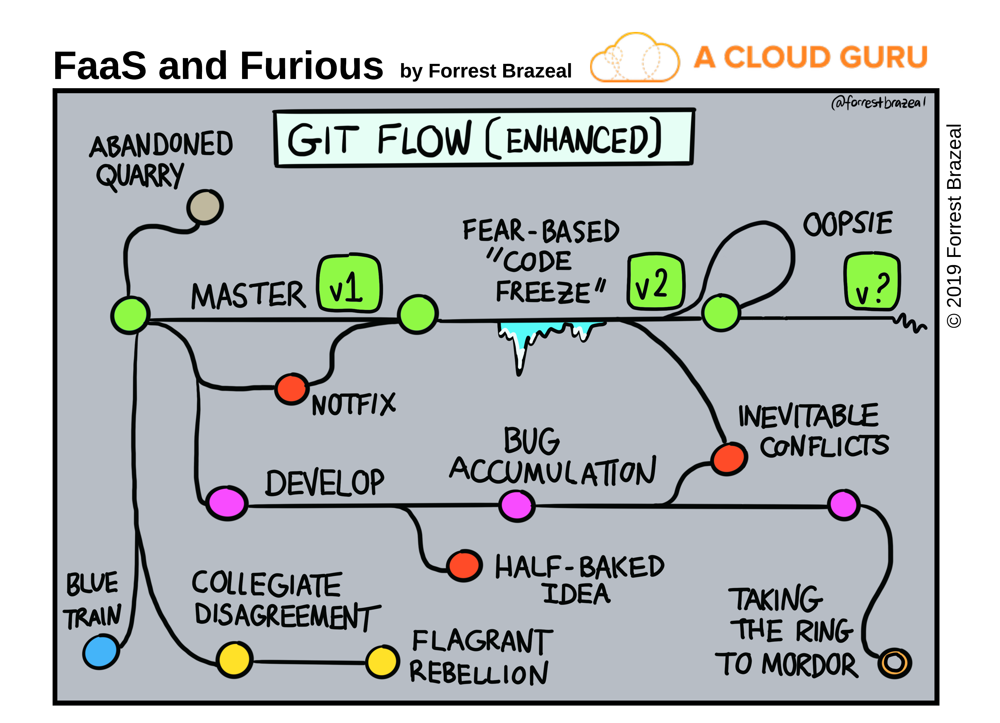
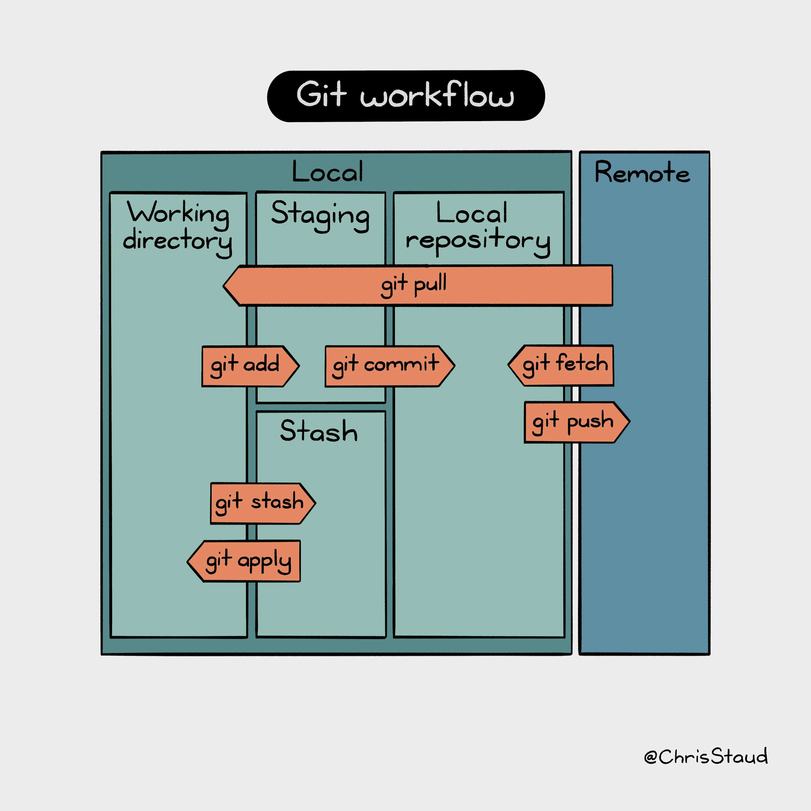

# <center>Git Pizza Freitag</center>

## <center>Ein Workshop zum Versionieren</center>

</br><div style="margin-left: auto;
            margin-right: auto;
            width: 65%">

</div></br>


### <center>Christian Rathnau</center></br>

<div style="margin-left: 330px;
            width: 35%
            ">

</div></br></br></br>

***
</br></br>
## <center> 1. Was ist ein Version Control System ?</center></br>

<div style="margin-left: auto;
            margin-right: auto;
            width: 75%"> 

-  Unterstützt bei der <b>Organisation (und dem Versionieren) von Dateien </b> jedweder Art

</br>

    - Systematische "Archivierung" und Aufzeichnung von Dateien / Dateistrukturen

    - Vollständiger Code Klon im lokalen Repository --> Offline / Remote Arbeit möglich
    
    - Änderungen sind jederzeit nachvollziehbar und Nutzern zuortbar
   
    - Ist nicht beschränkt auf Quellcode / Text
    
    - Annähernd alle Dateien auf Computern können versioniert werden
 
<br><br><br><br><br><br>

***
<br><br>
## <center> Grundkonzepte</center>
<br><br><br>

### <center> Hash Baum / Merkle Tree </center>
<br>

 <div style="margin-left: auto;
            margin-right: auto;">


    - Jeder Zweig / Node ist mit einem Kryptographischen Hash versehen

    - Ein Block / Blob beruht auf den Hashwerten seiner Kinder 

    - Vorteile:
        - Fähigkeit einer genauen Zuordnung einer Änderung bei Kenntnis des hashes 

    - Ermöglicht Schutz vor Integrittätsverlust

    - Ermöglicht ein es einen Zustand "zurück zu rechnen" 
</div><br><br><br><br>

***

<br><br>

### <center> Git commit
<br>

<div style="margin-left: auto;
        margin-right: auto;
        width:100%">

</div>
</div>


- Jede Speicherung erstellt einen Schnapschuss des Zustandes bei Speicherung (Hashwert wird kreiert)

- Bei neuen Commits werden durch die Hash Baum Logik neue Beziehungen zu anderen Commits hergestellt<br><br><br><br>

***
<br><br>

### <center> Git Branches
<br>

<div style="margin-left: auto;
            margin-right: auto;
            width: 100%">

</div>

- Branches sind zeiger die auf einen Commit in der Historie zum Ausgangspunkt für alle nachfolgenden Commits mit diesem zeiger dienen

- Arbeiten innerhalb dieses "Vorzeichens" sind unabhängig von anderen Vorzeichen (Branches)<br><br><br><br>

***
<br><br>

### <center> Git Workflows Feature adding
<br>

<div style="margin-left: auto;
            margin-right: auto;
            width: 100%">


</div>
<br><br><br>

### <center> Git Workflow mit Release
<br>
<div style="margin-left: auto;
            margin-right: auto;
            width: 100%">


</div> </br></br> </br></br>

***
<br>

 ## <center> Versionirungsstrategien im Überblick
 </br></br>

 ### <center> Bildbearbeitungsprogramm GIMP

 <br>
 <div style="margin-left: auto;
            margin-right: auto;
            width: 25%">


<br>

</div>
  <center> GIMP Projektdatei Historie
  </br></br>

 <div style="margin-left: auto;
            margin-right: auto;
            width: 100%">

***
<br>


<br>
*Student ;-)
</div></br>

***
<br>
<div style="margin-left: auto;
            margin-right: auto;
            width: 100%">


<div style="margin-left: auto;
            margin-right: auto;
            width: 100%">

## <center> Github Desktop Beispiel
<br>



Github Desktop Log / Historienanzeoge
</div></br>


<div style="margin-left: auto;
            margin-right: auto;
            width: 100%">

</div>
<center> Beispiel von unterschiedlichen Kontributoren

</br></br></br></br>
***


#### <center> Git Log als Cli Output und in bunt
<br>

<div style="margin-left: auto;
            margin-right: auto;
            width: 100%">

</div></br></br></br></br></br></br></br></br></br>
***
</br></br></br>

## <center>Boah wat?  Code? ... Konfig Dateien? ...</br></br> Pah! Ich benutze GUI !!1!1</center>

</br></br></br></br></br></br></br></br></br></br></br></br></br></br></br></br></br></br></br>
***

## <center><b>Hold your beer!</b></center></br></br>

<div style="margin-left: auto;
            margin-right: auto;
            width: 75%">

</div></br></br></br></br></br></br></br></br></br>

### <center>GUIs ändern sich</center></br>

 
<div style="margin-left: auto;
            margin-right: auto;
            width: 75%">

</div>


<div style="margin-left: auto;
            margin-right: auto;
            width: 75%">


</div></br></br>

<div style="margin-left: auto;
            margin-right: auto;
            width: 75%"></div></br></br>

### <center> Wget CLI Optionen 
<div style="margin-left: auto;
            margin-right: auto;
            width: 100%">

 </div></br></br>

<center>- GUIs bilden i.d.R. <strong>nicht</strong> Features ab</center><br>


<center>- informationstechnologische Trends zeigen auf</center><br>

<center><strong>API Calls--> Quellcode</strong></center><br>
<center>zur System / Service Administration / Konfiguration</center><br>

Kommandozeileninteraktion /<br> 
Die Entwicklung von Funktionen und Code Snippets <br>
verschafft <strong>tieferes</strong> Verständnis</br></br></br></br></br></br></br>

***

<br>


## <center>Ein typerischer Workflow</center>

<div style="margin-left: auto;
            margin-right: auto;
            width: 100%">


</div></br></br></br></br>
<div style="margin-left: auto;
            margin-right: auto;
            width: 100%">


</div></br></br></br></br>

***
</br></br></center></center>

<center>### Früh am Morgen</center>
<br>

```powershell
Write-Output "# STUFF" >> README.md # Set a file and file content 
git init # Initialize a new repository 
git add README.md # Add the created file to staging
git add .  # Add all files which where changed since last commit
git commit -m "first commit" # Commit local change to local repo
git branch -M main # Set branch name (default for future commits)
git remote add origin <Repo URL> # Set remote repo URL
git push --set-upstream -origin main # Set remote branchfor the current local branch
git push -u origin main # Push local repository (added commits) to remote repository
```
<br>
<center>Vor dem Mittagessen </center>
<br>

```bash
git fetch # Get info on colleague's work
git status # Show the  local changes vs. remote
git add <some-file> # or
git add . # Dangerous... know what you're adding!
git commit -m 'some useful message' # Add meaningful message
[main e6694c8] some useful message
 4 files changed, 39 insertions(+), 24 deletions(-)
 create mode 100644 Git Workshop.pdf
 create mode 100644 assets/git_workflow.png

git add <some-file>
git commit -m 'some more usefull message' # Add more meaningful message
[main e6694f8] some usefull message
 6 files changed, 349 insertions(+), 246 deletions(-)
 create mode 100644 Git Workshop.pdf
 create mode 100644 assets/something_else.jppgr
git add <some-file>
git commit -m 'some most usefulll message' # You know what to add here 
...
```
<div style="margin-left: auto;
            margin-right: auto;
            width: 100%">

.svg?cdnVersion=800)
</div>

- Commits sind nun im lokalen Repository und für den nächsten push Vorgang vorbereitet

***
<br><br>

<center>Git Push </center><br><br>

```bash
git push
Enumerating objects: 25, done.
Counting objects: 100% (25/25), done.
Delta compression using up to 12 threads
Compressing objects: 100% (18/18), done.
Writing objects: 100% (18/18), 18.08 MiB | 1.55 MiB/s, done.
Total 18 (delta 7), reused 0 (delta 0), pack-reused 0
remote: Resolving deltas: 100% (7/7), completed with 5 local objects.
To github.com:starfunkel/git_workshop.git
   5cf08fb..e6694c8  main -> main
```
<br></br>


</div>


<div style="margin-left: 600px;
            width: 35%
            ">


</div>

***
***
***

<br></br></br></br></br></br></br></br></br></br></br></br>## <center>Q&A</center></br></br></br></br></br></br></br></br></br></br></br></br>
***

