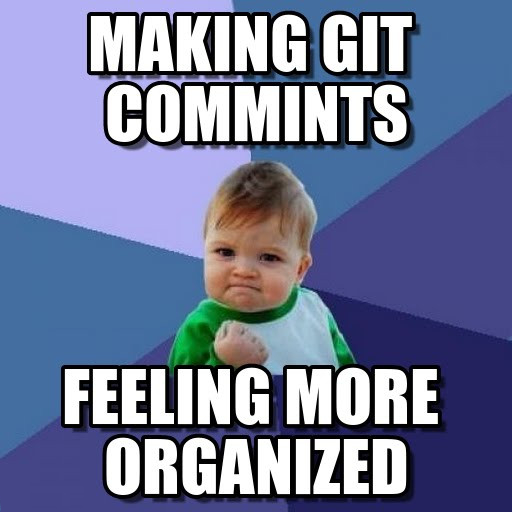
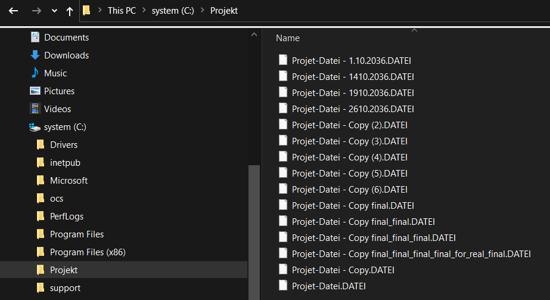

# <center>Git Pizza Freitag</center>

## <center>Ein Vortrag vom Versionieren</center>

</br><div style="margin-left: auto;
            margin-right: auto;
            width: 35%">

</div></br>

#### <center>Von Christian Rathnau</center></br>

<div style="margin-left: 350px;
            width: 35%
            ">

</div></br></br></br></br></br></br></br>

***
</br></br>
## <center> 1. Was ist ein Version Control System ?</center></br></br></br>

<div style="margin-left: auto;
            margin-right: auto;
            width: 75%">

 - Unterstützt bei der <b>Organisation von Projektdateien</b> jedweder Art</div></br>
 
 <div style="margin-left: auto;
            margin-right: auto;
            width: 75%">

</div></br>

<div style="margin-left: auto;
            margin-right: auto;
            width: 75%">

- Ermöglicht <b>Änderungsrückverfolgung</b> von Projektdateien</div></br></br>

<div style="margin-left: auto;
            margin-right: auto;
            width: 75%">

</div></br>

<div style="margin-left: auto;
            margin-right: auto;
            width: 75%">

- Ermöglicht den <b>Urheber</b> einer jeden Änderung zu identifizieren</div></br>

<div style="margin-left: auto;
            margin-right: auto;
            width: 75%">

</div></br></br></br></br>

***
</br></br></br></br></br></br></br></br>

## <center>Boah wat?  Code? ... Konfig Dateien? ...</br> Pah! Ich benutze GUI !!1!1</center></br></br></br></br></br>

## <center><b>Hold your beer!!</b></center></br></br>

<div style="margin-left: auto;
            margin-right: auto;
            width: 75%">

</div></br></br></br></br></br></br></br></br></br>


### <center>GUIs ändern sich</center></br>

 
<div style="margin-left: auto;
            margin-right: auto;
            width: 75%">

</div>


<div style="margin-left: auto;
            margin-right: auto;
            width: 75%">


</div></br></br>

<div style="margin-left: auto;
            margin-right: auto;
            width: 75%">

 - GUIs bilden i.d.R. nicht alle Features ab</div></br></br>

<div style="margin-left: auto;
            margin-right: auto;
            width: 75%">

 </div></br></br>


</br></br></br></br></br></br></br></br></br></br></br></br>

***
## <center>Real Life Beispiele</center>

</br></br></br>

### <center>Konfigdateien im Windows Umfeld (Fokus Administration)</center>

</br></br>

<div style="margin-left: auto;
            margin-right: auto;
            width: 70%">

|Switch Konfigs|Router Konfigs|Schedlued Task|Generic xmls|CMD, PoSh, Python Scripts|csv Dateien, Text Dateien|[*]
|-|-|-|-|-|-|-|
</br>
<center>[*]: Prinzipiel lassen sich alle Dateitypen mit Git versionieren. Bei Konfigdateien liegt der Vorteil auf der Hand. Man kann die Änderungen lesen.
</div>

</br></br></br></br></br></br></br></br></br>

#### <center>Dabei sind mit Git versionierte Dateien nicht bloße Historienketten von in der Vergangenheit gespeichertem Code.</center>

</br></br></br>

#### <center>Ein weiterer zentraler Ansatz ist die die Möglichkeit der Kollaboration im Team, oder völlig fremden Menschen über  einer Organisationsgrenzen.</center>

</br></br></br></br></br></br></br></br></br></br></br></br>

***
## <center>Ein typerischer Workflow</center>

Anfang

<div style="margin-left: auto;
            margin-right: auto;
            width: 70%">


</div>

lunch time

```bash
git status
git add <some-file>
git commit -m 'some usefull message'
git push
```

<div style="margin-left: auto;
            margin-right: auto;
            width: 70%">

.svg?cdnVersion=800)
</div>

git push -u origin marys-feature

<div style="margin-left: auto;
            margin-right: auto;
            width: 70%">


</div>

merging
<div style="margin-left: auto;
            margin-right: auto;
            width: 70%">


general Working

<div style="margin-left: auto;
            margin-right: auto;
            width: 70%">


</div>

branches

<div style="margin-left: auto;
            margin-right: auto;
            width: 70%">


</div>

release

<div style="margin-left: auto;
            margin-right: auto;
            width: 70%">


</div>


<div style="margin-left: 600px;
            width: 35%
            ">


</div>

****