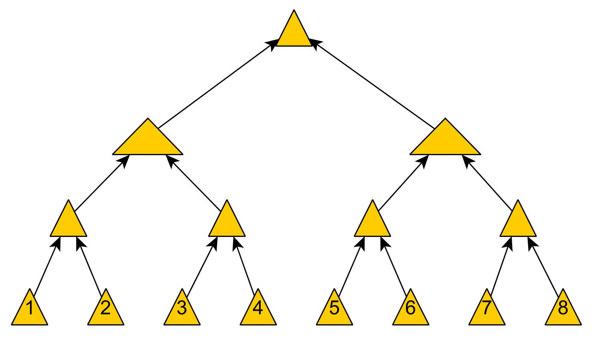

# <center>Git Pizza Freitag</center>

## <center>Ein Workshop zum Versionieren</center>

</br><div style="margin-left: auto;
            margin-right: auto;
            width: 65%">

</div></br>


### <center>Christian Rathnau</center></br>

<div style="margin-left: 330px;
            width: 35%
            ">

</div></br></br></br>

***
</br></br>
## <center> 1. Was ist ein Version Control System ?</center></br>

<div style="margin-left: auto;
            margin-right: auto;
            width: 75%">

-  Unterstützt bei der <b>Organisation (und dem Versionieren) von Dateien </b> jedweder Art

</br>

    - Systematische "Archivierung" und Aufzeichnung von Dateien / Dateistrukturen
    
    - Änderungen sind jederzeit nachvollziehbar und Nutzern zuortbar
   
    - Ist nicht beschränkt auf Quellcode / Text !!
    
    - Annähernd alle Dateien auf Computern können versioniert werden
 
<br><br><br><br><br><br>

 <div style="margin-left: auto;
            margin-right: auto;">

</div></br>

 </div></br></br>
 

 
 
 </br></br>

***

 ## <center> Versionirungsstrategien im Überblick

 <div style="margin-left: auto;
            margin-right: auto;
            width: 25%">

</div></br>

 <div style="margin-left: auto;
            margin-right: auto;
            width: 75%">

</div></br>

<div style="margin-left: auto;
            margin-right: auto;
            width: 75%">


<div style="margin-left: auto;
            margin-right: auto;
            width: 75%">

</div></br>


<div style="margin-left: auto;
            margin-right: auto;
            width: 105%">

</div></br></br></br></br>

#### <center> Git Log als Cli Output und in bunt

<div style="margin-left: auto;
            margin-right: auto;
            width: 120%">

</div></br></br></br></br></br></br></br></br></br>
***
</br></br></br>

## <center>Boah wat?  Code? ... Konfig Dateien? ...</br></br> Pah! Ich benutze GUI !!1!1</center></br></br></br></br></br></br></br></br></br></br></br>
***

## <center><b>Hold your beer!</b></center></br></br>

<div style="margin-left: auto;
            margin-right: auto;
            width: 75%">

</div></br></br></br></br></br></br></br></br></br>

### <center>GUIs ändern sich</center></br>

 
<div style="margin-left: auto;
            margin-right: auto;
            width: 75%">

</div>


<div style="margin-left: auto;
            margin-right: auto;
            width: 75%">


</div></br></br>

<div style="margin-left: auto;
            margin-right: auto;
            width: 75%"></div></br></br>


<div style="margin-left: auto;
            margin-right: auto;
            width: 100%">

 </div></br></br>

<center>- GUIs bilden i.d.R. <strong>nicht</strong> Features ab</center><br>


<center>- informationstechnologische Trends zeigen auf</center><br>

***

<center><strong>API Calls--> Quellcode</strong></center><br>
<center>zur System / Service Administration / Konfiguration</center><br>

***

<center> - Kommandozeileninteraktion verschafft <strong>tieferes</strong> Verständnis</center></br></br></br></br></br></br></br></

## <center>Changing point of view</center>
</br>
<center> Ermöglicht Kollaboration </center>
<center> - gemeinsame Arbeiten an einer Codebasisi</center></br></br></br></br></br></br></br></br></br></br></br></br>

## <center>Q&A</center>


</br></br></br></br></br></br></br></br></br></br></br></br>

***
</br></br></br>
## <center>Hands on!</center>
</br></br></br></br>


</br></br></br></br></br></br></br></br>***


## <center>Ein typerischer Workflow</center>

<div style="margin-left: auto;
            margin-right: auto;
            width: 100%">


</div></br></br></br></br>
<div style="margin-left: auto;
            margin-right: auto;
            width: 120%">


</div>

***</br></br></br></br></br></br>
Anfang

<div style="margin-left: auto;
            margin-right: auto;
            width: 70%">


</div>

Mittagessen

```bash
git status
git add <some-file> # or
git add . # Dangerous... know what you're adding!
git commit -m 'some usefull message'
[main e6694c8] some usefull message
 4 files changed, 39 insertions(+), 24 deletions(-)
 create mode 100644 Git Workshop.pdf
 create mode 100644 assets/git_workflow.png

git add <some-file>
git commit -m 'some more usefull message'
[main e6694f8] some usefull message
 6 files changed, 349 insertions(+), 246 deletions(-)
 create mode 100644 Git Workshop.pdf
 create mode 100644 assets/something_else.jppgr
git add <some-file>
git commit -m 'some most usefull message'
...
```
<div style="margin-left: auto;
            margin-right: auto;
            width: 70%">

.svg?cdnVersion=800)
</div>

- Commits sind nun im lokalen Repository und für den nächsten push Vorgang vorbereitet

***
</br></br></br></br></br></br></br></br></br></br></br></br>

```bash
git push
Enumerating objects: 25, done.
Counting objects: 100% (25/25), done.
Delta compression using up to 12 threads
Compressing objects: 100% (18/18), done.
Writing objects: 100% (18/18), 18.08 MiB | 1.55 MiB/s, done.
Total 18 (delta 7), reused 0 (delta 0), pack-reused 0
remote: Resolving deltas: 100% (7/7), completed with 5 local objects.
To github.com:starfunkel/git_workshop.git
   5cf08fb..e6694c8  main -> main
```

<div style="margin-left: auto;
            margin-right: auto;
            width: 70%">


</div>

- 

merging
<div style="margin-left: auto;
            margin-right: auto;
            width: 70%">


general Working

<div style="margin-left: auto;
            margin-right: auto;
            width: 70%">


</div>

branches

<div style="margin-left: auto;
            margin-right: auto;
            width: 70%">


</div>

release

<div style="margin-left: auto;
            margin-right: auto;
            width: 70%">


</div>


<div style="margin-left: 600px;
            width: 35%
            ">


</div>

****

https://ndpsoftware.com/git-cheatsheet.html#loc=stash;


 ### <center> Beispiel Workflow
 <br>

 <div style="margin-left: auto;
            margin-right: auto;
            width: 70%">


</div>